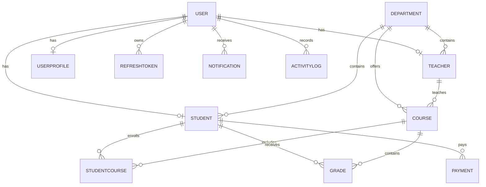

# University Management System

A full-stack university management platform built with **ASP.NET Core** and **Angular**.

The system provides role-based workflows for **Admin**, **Teacher**, and **Student**, including authentication, profile management, academic operations, notifications, file uploads, dashboard analytics, and cache-aware endpoints.

## Table of Contents

- [Project Overview](#project-overview)
- [Key Features](#key-features)
- [Tech Stack](#tech-stack)
- [Architecture and Repository Structure](#architecture-and-repository-structure)
- [Database ERD](#database-erd)
- [Entity Summary](#entity-summary)
- [Frontend Modules and Routes](#frontend-modules-and-routes)
- [Backend Modules](#backend-modules)
- [API Endpoints (Complete)](#api-endpoints-complete)
- [Run the Project](#run-the-project)
- [Deployment](#deployment)
- [Future Enhancements](#future-enhancements)

## Project Overview

This project is designed as a production-style university system with:

- JWT-based authentication and refresh token lifecycle
- Role-based authorization and guarded UI routes
- Core academic management: students, teachers, courses, enrollments, grades
- Notifications and profile workflows
- File management endpoints (upload/download/metadata)
- Dashboard analytics and caching layers
- Clean separation into Domain, Application, Infrastructure, and API

## Key Features

### Authentication and Authorization

- JWT access token login
- Refresh token flow (`refresh`, `revoke`, `revoke-all`, validation/stats endpoints)
- Role-based authorization (`Admin`, `Teacher`, `Student`)
- Token parsing + auto-refresh logic in Angular interceptors

### User Profile

- View/update profile
- Change password
- Upload profile picture
- Notification helper endpoints inside profile module

### Notifications

- List notifications
- Unread notifications and unread count
- Mark one/all as read
- Delete single/read notifications
- Admin notification dispatch endpoints

### File Management

- Upload files (configured max 5 MB by default)
- Download files
- File metadata and listing
- File delete endpoint

### Dashboard and Analytics

- Overview and comprehensive statistics
- Course, teacher, department, grade distribution insights
- Activity and performance endpoints
- Health/docs endpoints for observability

### Caching

- Memory cache registration + warm-up on startup
- Cache statistics/performance endpoints
- Invalidation endpoints by domain area
- Manual warm-up and clear operations

### Academic Operations

- Students CRUD + pagination/search/department filters
- Teachers CRUD + teacher-specific course/student operations
- Courses CRUD + role-specific views
- Enrollment workflows and checks
- Grades CRUD + stats + bulk grade operations
- Enhanced and sorting-focused endpoints

## Tech Stack

### Backend

- **.NET 10** (`net10.0`)
- ASP.NET Core Web API
- Entity Framework Core 10 + SQL Server
- JWT Bearer Authentication
- Swashbuckle (Swagger/OpenAPI)
- In-memory caching (`IMemoryCache`)
- Custom middleware and filters for error/validation handling

### Frontend

- **Angular 21** (standalone architecture)
- SCSS
- HTTP interceptors (JWT + refresh token)
- Route guards by role
- Role-based route tree and page scaffolds
- Centralized theme tokens (University Professional palette)

## Architecture and Repository Structure

```text
.
├─ UniversityManagement.API/              # API layer (controllers, middleware, filters, Program.cs)
├─ UniversityManagement.Application/      # DTOs and application contracts/models
├─ UniversityManagement.Domain/           # Domain entities
├─ UniversityManagement.Infrastructure/   # DbContext, services, auth, cache implementations
├─ frontend/                              # Angular app
├─ backend/                               # Alternative mirrored backend workspace (not in root solution)
└─ UniversityManagement.slnx              # Main solution (references the 4 UniversityManagement.* projects)
```

## Database ERD

> Note: The current implemented model uses `StudentCourse` as the enrollment bridge and a composite key in `Grade`.



## Entity Summary

- `Users`: identity/auth core (email, password hash, role, active status, timestamps)
- `UserProfiles`: profile and preference metadata for users
- `Students`: student records linked to `Users` and `Departments`
- `Teachers`: teacher records linked to `Users` and `Departments`
- `Departments`: organizational grouping for students, teachers, and courses
- `Courses`: academic courses linked to departments and optional teacher assignment
- `StudentCourses`: enrollment bridge (many-to-many student/course with enrollment date)
- `Grades`: student-course grade records (composite key: `StudentId + CourseId`)
- `Notifications`: per-user notifications (type, read state, metadata)
- `RefreshTokens`: token lifecycle persistence for JWT refresh flow
- `ActivityLogs`: user activity trace records
- `Payments`: student payment records (domain entity present)

## Frontend Modules and Routes

### Implemented frontend modules

- `auth` (login)
- `layout` (sidebar + main shell)
- `shared` (access denied + page placeholder)
- `admin`, `teacher`, `student` (route namespaces and scaffold pages)
- `core` (services, interceptors, guards)

### Current route coverage

- `/auth/login`
- `/access-denied`
- `/app/profile`
- `/app/change-password`
- `/app/notifications`
- `/app/upload-profile-picture`
- `/app/admin/*`:
  - `dashboard`, `students`, `students/details`, `teachers`, `teachers/details`,
  - `departments`, `courses`, `courses/details`, `enrollments`, `grades`, `settings`
- `/app/teacher/*`:
  - `dashboard`, `courses`, `course-students`, `grades`
- `/app/student/*`:
  - `dashboard`, `available-courses`, `enrolled-courses`, `grades`

## Backend Modules

### Controllers

- `AuthController`
- `RefreshTokenController`
- `UserProfileController`
- `NotificationController`
- `FileController`
- `DashboardController`
- `CacheController`
- `StudentController`
- `EnhancedStudentController`
- `TeacherController`
- `CourseController`
- `EnrollmentController`
- `GradeController`
- `SortingController`
- `SharedController`
- `AdminController`
- `PublicController`
- `ValidationDemoController`
- `ErrorDemoController`

### Cross-cutting

- Middleware: `ErrorHandlingMiddleware`, `ValidationMiddleware`
- Filters: `GlobalExceptionFilter`, `ModelValidationFilter`, `EnhancedValidationFilter`
- Caching decorators: `CachedDashboardService`, `CachedStudentService`

## API Endpoints (Complete)

> Base pattern: `/api/{ControllerName}`.
>
> The list below is generated from current controller attributes in the codebase.

### AdminController
| Method | Endpoint |
|---|---|
| GET | `/api/Admin/all-users` |
| POST | `/api/Admin/create-department` |
| DELETE | `/api/Admin/delete-user/{userId}` |

### AuthController
| Method | Endpoint |
|---|---|
| POST | `/api/Auth/register` |
| POST | `/api/Auth/login` |
| POST | `/api/Auth/refresh` |
| POST | `/api/Auth/revoke` |
| POST | `/api/Auth/revoke-all` |

### CacheController
| Method | Endpoint |
|---|---|
| GET | `/api/Cache/statistics` |
| POST | `/api/Cache/clear` |
| POST | `/api/Cache/clear/{pattern}` |
| POST | `/api/Cache/invalidate/dashboard` |
| POST | `/api/Cache/invalidate/students` |
| POST | `/api/Cache/invalidate/teachers` |
| POST | `/api/Cache/invalidate/courses` |
| POST | `/api/Cache/invalidate/grades` |
| POST | `/api/Cache/invalidate/enrollments` |
| POST | `/api/Cache/warmup` |
| POST | `/api/Cache/warmup/dashboard` |
| POST | `/api/Cache/warmup/students` |
| GET | `/api/Cache/performance` |
| GET | `/api/Cache/test` |
| GET | `/api/Cache/docs` |
| GET | `/api/Cache/health` |

### CourseController
| Method | Endpoint |
|---|---|
| GET | `/api/Course` |
| GET | `/api/Course/{id}` |
| POST | `/api/Course` |
| PUT | `/api/Course/{id}` |
| DELETE | `/api/Course/{id}` |
| GET | `/api/Course/department/{departmentId}` |
| GET | `/api/Course/teacher/{teacherId}` |
| GET | `/api/Course/available` |
| GET | `/api/Course/my-courses` |

### DashboardController
| Method | Endpoint |
|---|---|
| GET | `/api/Dashboard/comprehensive` |
| GET | `/api/Dashboard/overview` |
| GET | `/api/Dashboard/students` |
| GET | `/api/Dashboard/teachers` |
| GET | `/api/Dashboard/courses` |
| GET | `/api/Dashboard/grades` |
| GET | `/api/Dashboard/departments` |
| GET | `/api/Dashboard/activity` |
| GET | `/api/Dashboard/health` |
| GET | `/api/Dashboard/quick-stats` |
| GET | `/api/Dashboard/department/{departmentId}` |
| GET | `/api/Dashboard/teacher-workload` |
| GET | `/api/Dashboard/course-enrollments` |
| GET | `/api/Dashboard/grade-distribution` |
| GET | `/api/Dashboard/recent-activity` |
| GET | `/api/Dashboard/performance` |
| GET | `/api/Dashboard/docs` |
| GET | `/api/Dashboard/health` |

> Note: `DashboardController` currently defines two `GET /api/Dashboard/health` actions in code.

### EnhancedStudentController
| Method | Endpoint |
|---|---|
| GET | `/api/EnhancedStudent/enhanced-paginated` |
| POST | `/api/EnhancedStudent/advanced-search` |
| GET | `/api/EnhancedStudent/quick-search` |
| GET | `/api/EnhancedStudent/department-statistics/{departmentId}` |
| POST | `/api/EnhancedStudent/bulk-create` |
| POST | `/api/EnhancedStudent/export` |
| GET | `/api/EnhancedStudent/filter-by-department/{departmentId}` |
| GET | `/api/EnhancedStudent/paged` |
| GET | `/api/EnhancedStudent/search` |
| GET | `/api/EnhancedStudent/health` |
| GET | `/api/EnhancedStudent/docs` |

### EnrollmentController
| Method | Endpoint |
|---|---|
| GET | `/api/Enrollment` |
| POST | `/api/Enrollment` |
| GET | `/api/Enrollment/student/{studentId}` |
| GET | `/api/Enrollment/course/{courseId}` |
| DELETE | `/api/Enrollment/{studentId}/{courseId}` |
| GET | `/api/Enrollment/department/{departmentId}` |
| GET | `/api/Enrollment/check/{studentId}/{courseId}` |
| GET | `/api/Enrollment/stats/student/{studentId}` |
| GET | `/api/Enrollment/stats/course/{courseId}` |
| GET | `/api/Enrollment/my-courses` |
| GET | `/api/Enrollment/my-course-students/{courseId}` |

### ErrorDemoController
| Method | Endpoint |
|---|---|
| POST | `/api/ErrorDemo/test-validation` |
| GET | `/api/ErrorDemo/test-exceptions` |
| GET | `/api/ErrorDemo/test-success` |
| GET | `/api/ErrorDemo/test-model-binding/{id:int}` |
| GET | `/api/ErrorDemo/health` |
| GET | `/api/ErrorDemo/error-response-examples` |

### FileController
| Method | Endpoint |
|---|---|
| POST | `/api/File/upload` |
| GET | `/api/File/info/{fileName}` |
| DELETE | `/api/File/{fileName}` |
| GET | `/api/File/list` |
| GET | `/api/File/settings` |
| GET | `/api/File/download/{fileName}` |
| GET | `/api/File/docs` |
| GET | `/api/File/health` |

### GradeController
| Method | Endpoint |
|---|---|
| GET | `/api/Grade` |
| POST | `/api/Grade` |
| PUT | `/api/Grade/{studentId}/{courseId}` |
| DELETE | `/api/Grade/{studentId}/{courseId}` |
| GET | `/api/Grade/student/{studentId}` |
| GET | `/api/Grade/course/{courseId}` |
| GET | `/api/Grade/teacher/{teacherId}` |
| GET | `/api/Grade/statistics/student/{studentId}` |
| GET | `/api/Grade/statistics/course/{courseId}` |
| GET | `/api/Grade/my-grades` |
| GET | `/api/Grade/my-course-grades/{courseId}` |
| POST | `/api/Grade/bulk-grade` |

### NotificationController
| Method | Endpoint |
|---|---|
| GET | `/api/Notification/my-notifications` |
| GET | `/api/Notification/unread` |
| GET | `/api/Notification/unread-count` |
| POST | `/api/Notification/{id}/mark-read` |
| POST | `/api/Notification/mark-all-read` |
| DELETE | `/api/Notification/{id}` |
| DELETE | `/api/Notification/read` |
| POST | `/api/Notification/create` |
| GET | `/api/Notification/stats` |
| GET | `/api/Notification/types` |
| POST | `/api/Notification/cleanup` |
| POST | `/api/Notification/send-grade-notification` |
| POST | `/api/Notification/send-enrollment-notification` |
| POST | `/api/Notification/send-system-alert` |
| GET | `/api/Notification/docs` |
| GET | `/api/Notification/health` |

### PublicController
| Method | Endpoint |
|---|---|
| GET | `/api/Public/health` |
| GET | `/api/Public/departments` |

### RefreshTokenController
| Method | Endpoint |
|---|---|
| POST | `/api/RefreshToken/refresh` |
| POST | `/api/RefreshToken/revoke` |
| POST | `/api/RefreshToken/revoke-all` |
| GET | `/api/RefreshToken/info/{token}` |
| GET | `/api/RefreshToken/stats` |
| POST | `/api/RefreshToken/validate` |
| POST | `/api/RefreshToken/cleanup` |
| GET | `/api/RefreshToken/my-tokens` |
| GET | `/api/RefreshToken/docs` |
| GET | `/api/RefreshToken/health` |

### SharedController
| Method | Endpoint |
|---|---|
| GET | `/api/Shared/profile` |
| GET | `/api/Shared/departments` |
| POST | `/api/Shared/create-course` |

### SortingController
| Method | Endpoint |
|---|---|
| GET | `/api/Sorting/students` |
| GET | `/api/Sorting/students/multi-sort` |
| GET | `/api/Sorting/teachers` |
| GET | `/api/Sorting/courses` |
| GET | `/api/Sorting/grades` |
| GET | `/api/Sorting/departments` |
| GET | `/api/Sorting/metadata/{entityType}` |
| GET | `/api/Sorting/metadata` |
| GET | `/api/Sorting/demo` |
| GET | `/api/Sorting/health` |

### StudentController
| Method | Endpoint |
|---|---|
| GET | `/api/Student` |
| GET | `/api/Student/paginated` |
| GET | `/api/Student/{id}` |
| POST | `/api/Student` |
| PUT | `/api/Student/{id}` |
| DELETE | `/api/Student/{id}` |
| GET | `/api/Student/department/{departmentId}` |
| GET | `/api/Student/my-profile` |
| GET | `/api/Student/my-courses` |
| GET | `/api/Student/my-grades` |
| GET | `/api/Student/search` |

### TeacherController
| Method | Endpoint |
|---|---|
| GET | `/api/Teacher` |
| GET | `/api/Teacher/{id}` |
| POST | `/api/Teacher` |
| PUT | `/api/Teacher/{id}` |
| DELETE | `/api/Teacher/{id}` |
| GET | `/api/Teacher/department/{departmentId}` |
| GET | `/api/Teacher/my-profile` |
| GET | `/api/Teacher/my-courses` |
| POST | `/api/Teacher/add-grade` |
| GET | `/api/Teacher/students-in-course/{courseId}` |

### UserProfileController
| Method | Endpoint |
|---|---|
| GET | `/api/UserProfile/profile` |
| PUT | `/api/UserProfile/profile` |
| POST | `/api/UserProfile/change-password` |
| POST | `/api/UserProfile/upload-profile-picture` |
| GET | `/api/UserProfile/notifications/stats` |
| GET | `/api/UserProfile/notifications` |
| POST | `/api/UserProfile/notifications/{notificationId}/mark-read` |
| POST | `/api/UserProfile/notifications/mark-all-read` |
| GET | `/api/UserProfile/statistics` |
| GET | `/api/UserProfile/search` |
| GET | `/api/UserProfile/docs` |
| GET | `/api/UserProfile/health` |

### ValidationDemoController
| Method | Endpoint |
|---|---|
| POST | `/api/ValidationDemo/test-student-validation` |
| POST | `/api/ValidationDemo/test-teacher-validation` |
| POST | `/api/ValidationDemo/test-course-validation` |
| POST | `/api/ValidationDemo/test-grade-validation` |
| POST | `/api/ValidationDemo/test-registration-validation` |
| POST | `/api/ValidationDemo/test-login-validation` |
| GET | `/api/ValidationDemo/test-search-validation` |
| POST | `/api/ValidationDemo/test-advanced-search-validation` |
| POST | `/api/ValidationDemo/test-bulk-validation` |
| POST | `/api/ValidationDemo/test-missing-fields` |
| POST | `/api/ValidationDemo/test-invalid-data` |
| GET | `/api/ValidationDemo/validation-examples` |
| GET | `/api/ValidationDemo/health` |

## Run the Project

### Prerequisites

- .NET SDK 10.x
- SQL Server
- Node.js 20+ and npm
- EF Core CLI (`dotnet tool install --global dotnet-ef`) if not installed

### 1. Configure backend settings

Edit:

- `UniversityManagement.API/appsettings.json`

Required sections:

- `ConnectionStrings:DefaultConnection`
- `Jwt` (`Key`, `Issuer`, `Audience`)
- Optional: `TokenSettings`, `FileSettings`

### 2. Apply database migration

From repository root:

```bash
dotnet ef database update --project UniversityManagement.Infrastructure --startup-project UniversityManagement.API
```

### 3. Run backend API

```bash
dotnet run --project UniversityManagement.API
```

Default dev URL:

- `http://localhost:5219`
- Swagger (Development): `http://localhost:5219/swagger`

### 4. Run Angular frontend

In a second terminal:

```bash
cd frontend
npm install
npm start
```

Default frontend URL:

- `http://localhost:4200`

Current frontend API base is configured in:

- `frontend/src/environments/environment.ts`
- Default: `http://localhost:5219/api`

## Deployment

### Backend

- IIS
- Docker
- Azure App Service

### Frontend

- `ng build --configuration production`
- Nginx / static hosting
- Azure Static Web Apps

## Future Enhancements

- Attendance management
- Online payment workflows
- Internal chat/messaging
- PDF reporting
- Teacher evaluation
- Timetable scheduling
